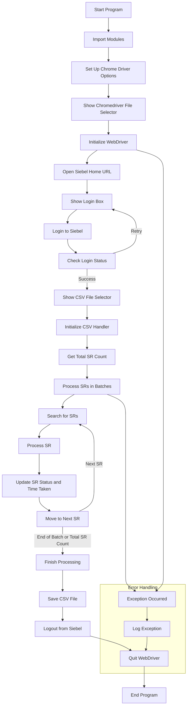
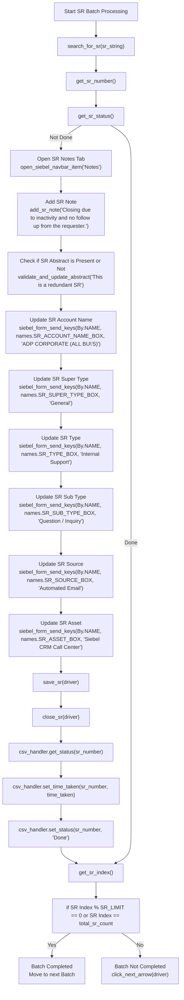

## Description of `main.py`

The `main.py` file serves as the entry point for the project and is responsible for orchestrating the following tasks:

### 1. Configuration of WebDriver Options
- **Setup Options**: Configures Chrome WebDriver options to ignore SSL errors, disable image loading, and apply performance settings. Optionally, it can run the browser in headless mode.

### 2. WebDriver Initialization
- **Chromedriver Path**: Prompts the user to select the path to the ChromeDriver executable using `easygui`.
- **Driver Initialization**: Initializes the Chrome WebDriver with the specified options.

### 3. Login Process
- **Navigate and Login**: Opens the Siebel home URL and prompts the user for login credentials via `easygui`.
- **Authentication**: Attempts to log in using the provided credentials and handles retries if necessary.

### 4. CSV File Handling
- **File Selection**: Prompts the user to select a CSV file containing Service Request (SR) data.
- **CSV Management**: Utilizes a `handler` class to read and manipulate the CSV file, including retrieving SR numbers and updating their statuses.

### 5. SR Processing
- **Iteration and Search**: Processes SR numbers from the CSV file, searches for each SR in the Siebel system, and performs updates based on their status.
- **Updates**: Adds notes, updates fields, and saves the SR in the Siebel system.

### 6. Error Handling and Cleanup
- **Exception Handling**: Catches and logs exceptions occurring during execution.
- **Resource Management**: Ensures the CSV file is saved and the WebDriver is properly closed, logging these actions.

### Key Operations
- **WebDriver Setup**: Configures and initializes the browser for automation.
- **Login Handling**: Manages user authentication with Siebel.
- **CSV Handling**: Processes and updates data from the CSV file.
- **Service Request Processing**: Automates interaction with Siebel for each SR, including updates and saving changes.
- **Error Management**: Logs errors and ensures proper resource closure.

Overall, `main.py` orchestrates the entire workflow of the application, from WebDriver setup to SR processing and user interaction through GUI prompts.

## Description of `automator.py`

The `automator.py` file contains functions for automating interactions with the Siebel CRM system. These functions use Selenium WebDriver to perform various tasks such as logging in, searching for service requests, and updating fields.

### Key Functions

1. **`login_to_siebel(driver, uid, pwd)`**
   - **Purpose**: Logs into the Siebel CRM system using the provided user ID and password.
   - **Parameters**: 
     - `driver`: Selenium WebDriver instance.
     - `uid`: User ID for login.
     - `pwd`: Password for login.
   - **Operation**: Enters login credentials and submits the login form.

2. **`search_for_sr(driver, sr_string)`**
   - **Purpose**: Searches for service requests (SR) based on the provided SR string.
   - **Parameters**:
     - `driver`: Selenium WebDriver instance.
     - `sr_string`: String containing SR numbers to search for.
   - **Operation**: Enters SR numbers into the search field and executes the search.

3. **`get_sr_number(driver)`**
   - **Purpose**: Retrieves the SR number from the search results.
   - **Parameters**:
     - `driver`: Selenium WebDriver instance.
   - **Operation**: Extracts the SR number from the displayed results.

4. **`get_sr_status(driver)`**
   - **Purpose**: Gets the current status of the service request.
   - **Parameters**:
     - `driver`: Selenium WebDriver instance.
   - **Operation**: Fetches the status of the SR from the CRM system.

5. **`open_siebel_navbar_item(driver, item_name)`**
   - **Purpose**: Opens a navigation item in the Siebel CRM system.
   - **Parameters**:
     - `driver`: Selenium WebDriver instance.
     - `item_name`: Name of the navigation item to open.
   - **Operation**: Clicks on the specified navigation item.

6. **`add_sr_note(driver, sr_note)`**
   - **Purpose**: Adds a note to the service request.
   - **Parameters**:
     - `driver`: Selenium WebDriver instance.
     - `sr_note`: Note text to add.
   - **Operation**: Inputs and saves the provided note.

7. **`validate_and_update_abstract(driver, abstract)`**
   - **Purpose**: Validates and updates the abstract field of the service request.
   - **Parameters**:
     - `driver`: Selenium WebDriver instance.
     - `abstract`: New abstract text to set.
   - **Operation**: Updates the SR's abstract field with the new value.

8. **`siebel_form_send_keys(driver, by_field, query_field, key, wait_time)`**
   - **Purpose**: Sends keys to a form field in Siebel CRM.
   - **Parameters**:
     - `driver`: Selenium WebDriver instance.
     - `by_field`: Locator strategy (e.g., `By.NAME`).
     - `query_field`: Field locator.
     - `key`: Text to input.
     - `wait_time`: Time to wait for the field to become interactable.
   - **Operation**: Waits for the field and sends the specified keys.

9. **`save_sr(driver)`**
   - **Purpose**: Saves changes made to the service request.
   - **Parameters**:
     - `driver`: Selenium WebDriver instance.
   - **Operation**: Clicks the save button to persist changes.

10. **`close_sr(driver)`**
    - **Purpose**: Closes the service request.
    - **Parameters**:
      - `driver`: Selenium WebDriver instance.
    - **Operation**: Clicks the close button to finalize the SR.

11. **`get_sr_index(driver)`**
    - **Purpose**: Retrieves the current index of the service request.
    - **Parameters**:
      - `driver`: Selenium WebDriver instance.
    - **Operation**: Extracts the index of the SR from the CRM system.

12. **`click_next_arrow(driver)`**
    - **Purpose**: Clicks the "Next" arrow to move to the next SR.
    - **Parameters**:
      - `driver`: Selenium WebDriver instance.
    - **Operation**: Navigates to the next SR in the list.

13. **`logout_from_siebel(driver)`**
    - **Purpose**: Logs out of the Siebel CRM system.
    - **Parameters**:
      - `driver`: Selenium WebDriver instance.
    - **Operation**: Clicks the logout button to end the session.

### Summary
`automator.py` contains functions that facilitate the automation of various tasks within the Siebel CRM system using Selenium WebDriver. These functions include logging in, searching for and updating service requests, and performing other CRM operations.

## Description of `constants.py`

The `constants.py` file defines various constants used throughout the project. These constants include configuration values, URLs, IDs, names, and XPath expressions related to the Siebel CRM system.

### Constants

- **`SR_LIMIT`**: 
  - **Value**: `101`
  - **Purpose**: Defines the limit for the number of service requests to process in each batch.

- **`MAX_LOOP_ITER`**: 
  - **Value**: `10`
  - **Purpose**: Specifies the maximum number of loop iterations to prevent infinite loops.

### URL Constants

- **`urls.SIEBEL_HOME_URL`**: 
  - **Value**: `'https://crm.es.oneadp.com/siebel/app/callcenter/enu?SWECmd=Start&'`
  - **Purpose**: URL for the home page of Siebel CRM.

- **`urls.SR_URL`**: 
  - **Value**: `'https://crm.es.oneadp.com/siebel/app/callcenter/enu?SWECmd=GotoView&SWEView=Service+Request+Screen+Homepage+View'`
  - **Purpose**: URL for the Service Request Screen Homepage View in Siebel CRM.

- **`urls.SIEBEL_LOGOUT_URL`**: 
  - **Value**: `'https://crm.es.oneadp.com/siebel/app/callcenter/enu?SWECmd=Logoff&SWEPreLd=1&SWETS={epoch_time}'`
  - **Purpose**: URL for logging out of the Siebel CRM system. `{epoch_time}` is a placeholder for the current time.

### ID Constants

- **`ids.LOGIN_UID_TEXT_BOX`**: 
  - **Value**: `'s_swepi_1'`
  - **Purpose**: ID of the user ID text box on the login page.

- **`ids.LOGIN_PWD_TEXT_BOX`**: 
  - **Value**: `'s_swepi_2'`
  - **Purpose**: ID of the password text box on the login page.

- **`ids.LOGIN_BUTTON`**: 
  - **Value**: `'s_swepi_22'`
  - **Purpose**: ID of the login button.

- **`ids.LOGIN_STATUS_BAR_ID`**: 
  - **Value**: `'statusBar'`
  - **Purpose**: ID of the login status bar.

- **`ids.SERVICE_REQUESTS_ANCHOR`**: 
  - **Value**: `'ui-id-99'`
  - **Purpose**: ID of the Service Requests anchor.

- **`ids.SERVICE_REQUESTS_GO_BUTTON`**: 
  - **Value**: `'s_4_1_18_0_Ctrl'`
  - **Purpose**: ID of the "Go" button for Service Requests.

- **`ids.SR_NUMBER`**: 
  - **Value**: `'s_1_1_174_0_mb'`
  - **Purpose**: ID of the Service Request Number field.

- **`ids.PREVIOUS_SR_ARROW`**: 
  - **Value**: `'s_1_1_238_0'`
  - **Purpose**: ID of the previous SR arrow button.

- **`ids.NEXT_SR_ARROW`**: 
  - **Value**: `'s_1_1_236_0'`
  - **Purpose**: ID of the next SR arrow button.

- **`ids.SR_COUNT`**: 
  - **Value**: `'s_1_rc'`
  - **Purpose**: ID for displaying SR count.

- **`ids.SAVE_BUTTON`**: 
  - **Value**: `'s_1_1_155_0_Ctrl'`
  - **Purpose**: ID of the save button.

- **`ids.SR_OPTIONS_NAVIGATION_BAR`**: 
  - **Value**: `'s_vctrl_div_tabScreen'`
  - **Purpose**: ID of the SR options navigation bar.

- **`ids.SR_OPTIONS_NAVIGATION_DROP_DOWN`**: 
  - **Value**: `'j_s_vctrl_div_tabScreen'`
  - **Purpose**: ID of the SR options navigation dropdown.

- **`ids.SR_CLOSE_BUTTON`**: 
  - **Value**: `'s_1_1_207_0_Ctrl'`
  - **Purpose**: ID of the SR close button.

- **`ids.SR_NOTES_ADD_BUTTON`**: 
  - **Value**: `'s_2_1_7_0_Ctrl'`
  - **Purpose**: ID of the button to add notes to SR.

- **`ids.SR_NOTE_DIV`**: 
  - **Value**: `'s_2_l_scroll'`
  - **Purpose**: ID of the div containing SR notes.

### Name Constants

- **`names.SR_NUMBER_BOX`**: 
  - **Value**: `'s_4_1_19_0'`
  - **Purpose**: Name of the SR Number box.

- **`names.SR_SUPER_TYPE_BOX`**: 
  - **Value**: `'s_1_1_54_0'`
  - **Purpose**: Name of the SR Super Type box.

- **`names.SR_TYPE_BOX`**: 
  - **Value**: `'s_1_1_194_0'`
  - **Purpose**: Name of the SR Type box.

- **`names.SR_SUB_TYPE_BOX`**: 
  - **Value**: `'s_1_1_195_0'`
  - **Purpose**: Name of the SR Sub Type box.

- **`names.SR_SOURCE_BOX`**: 
  - **Value**: `'s_1_1_197_0'`
  - **Purpose**: Name of the SR Source box.

- **`names.SR_ASSET_BOX`**: 
  - **Value**: `'s_1_1_191_0'`
  - **Purpose**: Name of the SR Asset box.

- **`names.SR_ACCOUNT_NAME_BOX`**: 
  - **Value**: `'s_1_1_101_0'`
  - **Purpose**: Name of the SR Account Name box.

- **`names.SR_STATUS_BOX`**: 
  - **Value**: `'s_1_1_200_0'`
  - **Purpose**: Name of the SR Status box.

- **`names.SR_ABSTRACT_BOX`**: 
  - **Value**: `'s_1_1_188_0'`
  - **Purpose**: Name of the SR Abstract box.

### XPath Constants

- **`xpaths.SR_NAV_BAR_ITEMS`**: 
  - **Value**: `"//ul/li/a[text()='{item_name}']"`
  - **Purpose**: XPath expression to locate navigation bar items.

- **`xpaths.SR_NAV_BAR_DROPDOWN_OPTION`**: 
  - **Value**: `"//ul/li/select/option[text()='{item_name}']"`
  - **Purpose**: XPath expression to locate dropdown options in the navigation bar.

- **`xpaths.SR_NOTE_DESCRIPTION`**: 
  - **Value**: `"//table/tbody/tr[@id=1]/td[@aria-roledescription='Description']"`
  - **Purpose**: XPath expression to locate the SR note description.

- **`xpaths.SR_NOTE_TEXTAREA`**: 
  - **Value**: `"//table/tbody/tr[@id=1]/td[@aria-roledescription='Description']/textarea"`
  - **Purpose**: XPath expression to locate the SR note textarea.

### Summary
`constants.py` serves as a central repository for configuration and constants related to URLs, element IDs, names, and XPath expressions used in the automation of interactions with the Siebel CRM system.

## Description of `csv_handler.py`

The `csv_handler.py` file contains a class and functions for handling CSV files used in the project. The class is responsible for reading, processing, and updating CSV files that track the status and processing time of service requests (SRs).

### Imports

- **`warnings`**: Suppresses FutureWarnings.
- **`pandas`**: Used for data manipulation and analysis.
- **`base_logger`**: Custom logger for logging debug and information messages.

### Decorators

- **`log_entry`**: A decorator to log entry into methods with function name and arguments.

### `handler` Class

#### Initialization

- **`__init__(self, csv_path)`**: 
  - Initializes the handler by loading the CSV file from the provided path.
  - Checks if required columns (`STATUS_COL` and `TT_COL`) are present; if not, creates them.
  - Logs the creation of the handler and the provided CSV path.
  - Drops rows with missing SR numbers and counts the remaining SRs.

#### Methods

- **`get_sr_string(self, start, end) -> str`**:
  - Retrieves SR numbers from the CSV between specified indices.
  - Returns the SR numbers as a string, joined by " OR ".

- **`get_status(self, sr_number: str) -> str`**:
  - Retrieves the status of a specific SR number from the CSV.
  - Raises a `ValueError` if the SR number is not found.

- **`set_status(self, sr_number: str, status: str) -> None`**:
  - Updates the status of a specific SR number in the CSV.
  - Raises a `ValueError` if the SR number is not found.

- **`set_time_taken(self, sr_number: str, time_taken: str) -> None`**:
  - Updates the time taken for a specific SR number in the CSV.
  - Raises a `ValueError` if the SR number is not found.

- **`total_srs(self) -> int`**:
  - Returns the total number of SRs in the CSV.

- **`save_csv(self) -> None`**:
  - Saves the updated CSV file to the original path.
  - Logs a message if the file is saved successfully or logs an exception if an error occurs.

### Summary
The `csv_handler.py` file provides functionality to manage the CSV files that track service requests, including methods to read, update, and save data related to SR statuses and processing times.

## Description of `base_logger.py`

The `base_logger.py` file sets up a custom logging configuration for the project, allowing for both console and file logging with different formats based on log levels.

### Imports

- **`logging`**: Standard library for logging events.
- **`colorama`**: Provides color and style formatting for console output.
- **`datetime`**: Used for timestamping logs.
- **`sys`**: Provides access to system-specific parameters and functions.
- **`os`**: Provides a way to interact with the operating system.

### `CustomFormatter` Class

- **Purpose**: Custom formatter for console logs with color-coding based on log levels.
- **Attributes**:
  - **`levelname`**: Template for log level name.
  - **`format_string`**: Template for log message format.
  - **`FORMATS`**: Dictionary defining color formats for different log levels.
- **Methods**:
  - **`format(self, record)`**: Formats the log record according to the log level using `FORMATS`.

### `FileCustomFormatter` Class

- **Purpose**: Custom formatter for file logs with a standard format.
- **Attributes**:
  - **`format_string`**: Template for log message format.
- **Methods**:
  - **`format(self, record)`**: Formats the log record using `format_string`.

### Logging Setup

1. **Console Handler (`ch`)**:
   - **Level**: INFO
   - **Formatter**: Uses `CustomFormatter` for colored output.

2. **File Handler (`fh`)**:
   - **Level**: DEBUG
   - **Formatter**: Uses `FileCustomFormatter` for standard output.
   - **File Path**: Log files are stored in a `logs` directory with a timestamp in the filename.
   - **Directory Creation**: Creates the `logs` directory if it does not exist.

### Summary
The `base_logger.py` file provides a configuration for logging with custom formatting for both console and file outputs. Console logs are color-coded based on severity, while file logs use a standard format. The file handles setting up and managing log files, ensuring logs are properly formatted and stored.

## Description of `gui.py`

The `gui.py` file provides graphical user interface (GUI) functions for user interactions using the `easygui` library. It simplifies the process of obtaining user input and selecting files through dialog boxes.

### Imports

- **`easygui`**: A library for creating simple GUI dialogs.
- **`base_logger`**: For logging events and errors related to GUI interactions.

### Functions

#### `show_login_box(retry=False) -> list`

- **Purpose**: Displays a multi-password input dialog for user credentials (User ID and Password).
- **Parameters**:
  - **`retry`**: A boolean flag indicating if the dialog should prompt for credentials again in case of an error.
- **Returns**: A list containing the entered User ID and Password.
- **Behavior**:
  - Shows an error message if credentials are empty or invalid.
  - Recursively prompts for valid credentials if needed.

#### `show_file_selector(title, allowed_file_type=None)`

- **Purpose**: Opens a file selection dialog to choose a file.
- **Parameters**:
  - **`title`**: The title of the file dialog.
  - **`allowed_file_type`**: Optional filter for allowed file extensions.
- **Returns**: The path of the selected file.
- **Behavior**:
  - Validates file extension if `allowed_file_type` is specified.
  - Raises an exception if no file is selected or the file format is invalid.

### Summary

The `gui.py` file facilitates user interactions by providing simple dialog boxes for entering login credentials and selecting files. It handles user inputs through `easygui` dialogs and incorporates logging to track user interactions and potential issues.

## Top level Execution Chart of Main.py

## Function Call Trace of SR V Batch Processing

### `siebel_form_send_keys(driver, wait_time, by_field, query_field, key)`

The `siebel_form_send_keys()` function is designed to input text into a form field within the Siebel application using Selenium. This function attempts to locate a web element and send keys to it, with built-in retry logic to handle cases where the element might not be immediately available.

#### Parameters:
- **`driver`** (`WebDriver`): The Selenium WebDriver instance used to interact with the web page.
- **`wait_time`** (`int`): The maximum amount of time (in seconds) to wait for the element to be present.
- **`by_field`** (`By`): The method used to locate the element (e.g., `By.NAME`, `By.ID`).
- **`query_field`** (`str`): The value used to locate the element (e.g., element ID, name).
- **`key`** (`str`): The text to be sent to the input field.

#### Functionality:
1. **Logging the Key**:
   - The function logs the key value being sent to the form field for debugging purposes.

2. **Retry Mechanism**:
   - Initializes a `delay` variable starting at 1 second and an `itr` (iteration) counter starting at 1.
   - Enters a loop with a maximum of `MAX_LOOP_ITER` iterations.

3. **Element Interaction**:
   - Inside the loop, the function attempts to find the web element using the provided `by_field` and `query_field`.
   - If the element is found, it is made visible (in case it's hidden) by setting its `display` style to `block`.
   - Clears any existing text in the field and sends the new text (`key`) to it.
   - Exits the loop if successful.

4. **Exception Handling**:
   - If an exception occurs (e.g., element not found, stale element reference), it logs the exception details and waits for a short period before retrying.
   - Increases the delay by 1 second on each iteration to account for potential delays in element availability.

5. **Failure Handling**:
   - If the maximum number of iterations is reached without successfully interacting with the element, the function raises an exception indicating that the maximum loop iterations were reached.

#### Purpose:
The primary purpose of this function is to ensure that the form field is available and ready to receive input, even if it takes some time for the field to become interactable. This is particularly useful in web applications with dynamic content where elements might load or become available after a delay.

### `open_siebel_navbar_item(driver, item_name)`

The `open_siebel_navbar_item()` function is used to interact with and open a specific item in the Siebel navigation bar using Selenium. It handles cases where the item may be directly clickable or may require interaction with a dropdown menu.

#### Parameters:
- **`driver`** (`WebDriver`): The Selenium WebDriver instance used to interact with the web page.
- **`item_name`** (`str`): The name of the navigation bar item to be opened.

#### Functionality:
1. **Locate Navigation Bar**:
   - The function first attempts to locate the navigation bar element using its ID (`ids.SR_OPTIONS_NAVIGATION_BAR`).

2. **Try Direct Click**:
   - It tries to find and click the desired navigation bar item directly using its XPath (`xpaths.SR_NAV_BAR_ITEMS`), which is formatted with the `item_name`.
   - If the item is found and clicked, the function completes and returns.

3. **Handle Dropdown Menu**:
   - If the direct click attempt fails (e.g., the item is not present or not clickable), the function logs that the item was not found in the navigation bar and attempts to open a dropdown menu.
   - It then enters a loop with a maximum of `MAX_LOOP_ITER` iterations to retry finding the item in the dropdown.

4. **Retry Mechanism**:
   - Within the loop, it tries to find the item in the dropdown menu using its XPath (`xpaths.SR_NAV_BAR_DROPDOWN_OPTION`).
   - If the item is found and clicked, the loop breaks.

5. **Exception Handling**:
   - If an exception occurs (e.g., element not found, stale element reference), the function logs the exception and waits for a short period before retrying.
   - The delay increases by 1 second with each iteration to account for potential delays in the element's availability.

6. **Failure Handling**:
   - If the maximum number of iterations is reached without successfully finding or clicking the item, the function raises an exception indicating that the maximum loop iterations were reached.

#### Purpose:
The function ensures that the specified navigation bar item is opened, whether it is directly clickable or hidden within a dropdown menu. This is useful for navigating complex user interfaces where menu items might be dynamically loaded or require interaction with nested elements.

### `add_sr_note(driver, sr_note)`

The `add_sr_note()` function is used to add a note to a service request (SR) in the Siebel application. It handles the process of locating the "Add Note" button, interacting with the note input fields, and inputting the provided note text.

#### Parameters:
- **`driver`** (`WebDriver`): The Selenium WebDriver instance used to interact with the web page.
- **`sr_note`** (`str`): The text of the note to be added to the service request.

#### Functionality:
1. **Locate and Click "Add Note" Button**:
   - The function initializes a retry mechanism to find and click the "Add Note" button, identified by its ID (`ids.SR_NOTES_ADD_BUTTON`).
   - It enters a loop with a maximum of `MAX_LOOP_ITER` iterations to account for potential delays or issues in locating the button.
   - On each iteration, it attempts to find the button and click it. If successful, it breaks out of the loop.

2. **Handle Exception**:
   - If an exception occurs (e.g., element not found, stale element reference), the function logs the exception details and waits for a short period before retrying.
   - The delay increases by 1 second with each iteration to manage potential delays in element availability.

3. **Locate and Fill Note Text Area**:
   - After successfully clicking the "Add Note" button, the function continues to a second retry mechanism to find the note text area.
   - It waits for the note section to become visible and locates the note text area using its XPath (`xpaths.SR_NOTE_TEXTAREA`).
   - It then clicks on the note text area, clears any existing text, and inputs the provided `sr_note` text.

4. **Log Success**:
   - Upon successfully adding the note, the function logs a message indicating that the note was added.

5. **Failure Handling**:
   - If the maximum number of iterations is reached without successfully interacting with the note section, the function raises an exception indicating that the maximum loop iterations were reached.

#### Purpose:
The function ensures that a note can be added to a service request by managing interactions with dynamic elements and handling cases where elements might not be immediately available. It is particularly useful for automating the process of adding notes in a web application with complex or delayed UI elements.

### `log_entry(func)`

The `log_entry()` function is a decorator used to add logging functionality to other functions. It wraps a function to log its entry and exit, providing a way to trace the execution flow and debug issues.

#### Parameters:
- **`func`** (`Callable`): The function to be decorated. This is the function whose execution will be logged.

#### Functionality:
1. **Decorator Definition**:
   - The `log_entry()` function takes another function (`func`) as an argument and returns a new function (`wrapper`) that wraps the original function.

2. **Wrapper Function**:
   - **Logging Entry**:
     - When the wrapped function is called, the `wrapper` function logs a debug message indicating that the decorated function has been entered. It uses the function's name (`func.__name__`) to provide context in the log message.
   - **Function Execution**:
     - The `wrapper` function then calls the original function (`func`) with the provided arguments (`*args`) and keyword arguments (`**kwargs`), allowing it to execute as intended.
   - **Return Value**:
     - After executing the original function, the `wrapper` function returns the result of the function call.

3. **Logging Framework**:
   - The logging is handled using the `logger.debug()` method, which logs messages at the DEBUG level. This is useful for development and debugging but might be turned off or redirected in production environments.

#### Purpose:
The `log_entry()` decorator provides a simple way to add entry logging to functions. This helps in tracking function calls and understanding the flow of execution, which is valuable for debugging and monitoring. By using this decorator, developers can easily add consistent logging across multiple functions without manually adding log statements to each one.

